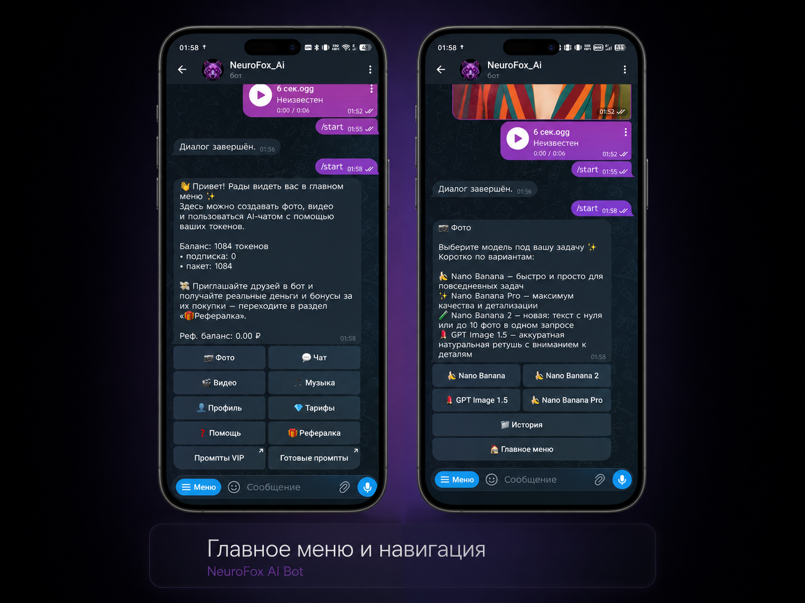
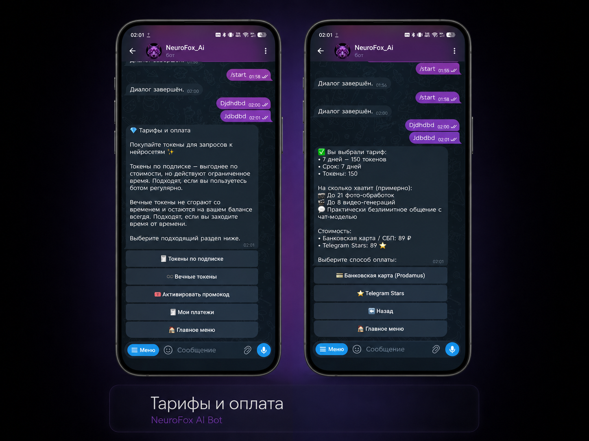
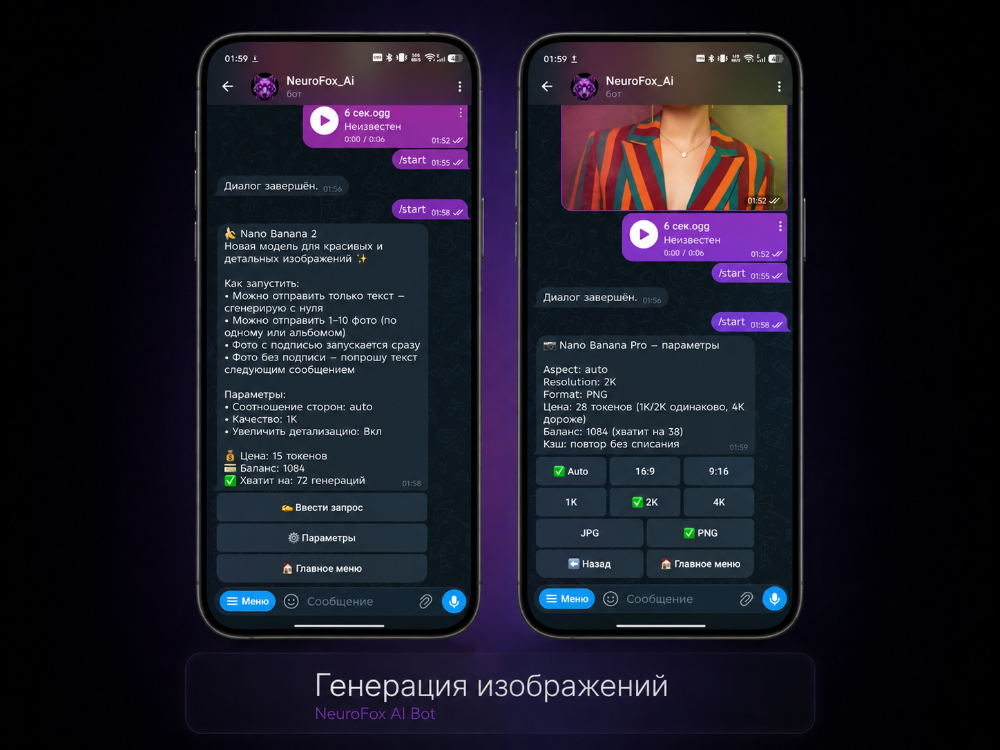
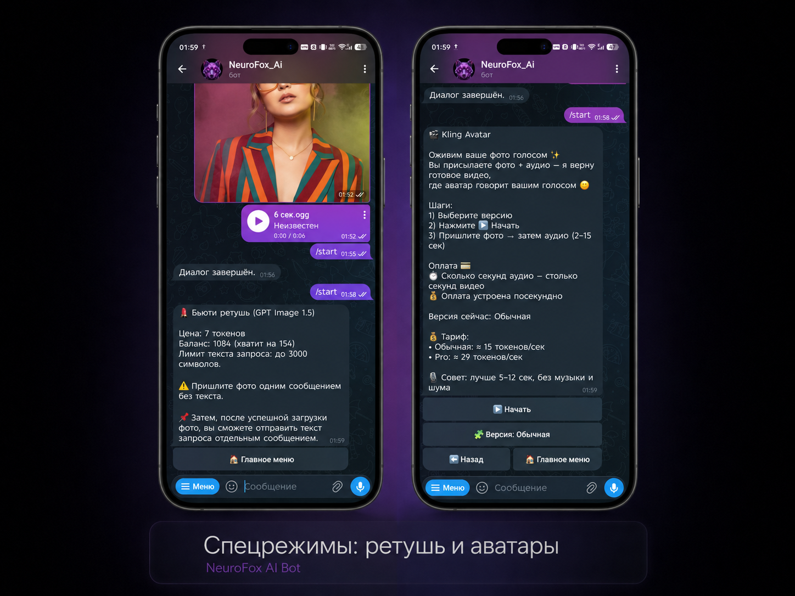
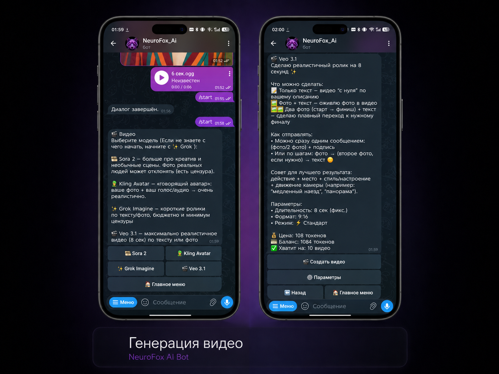
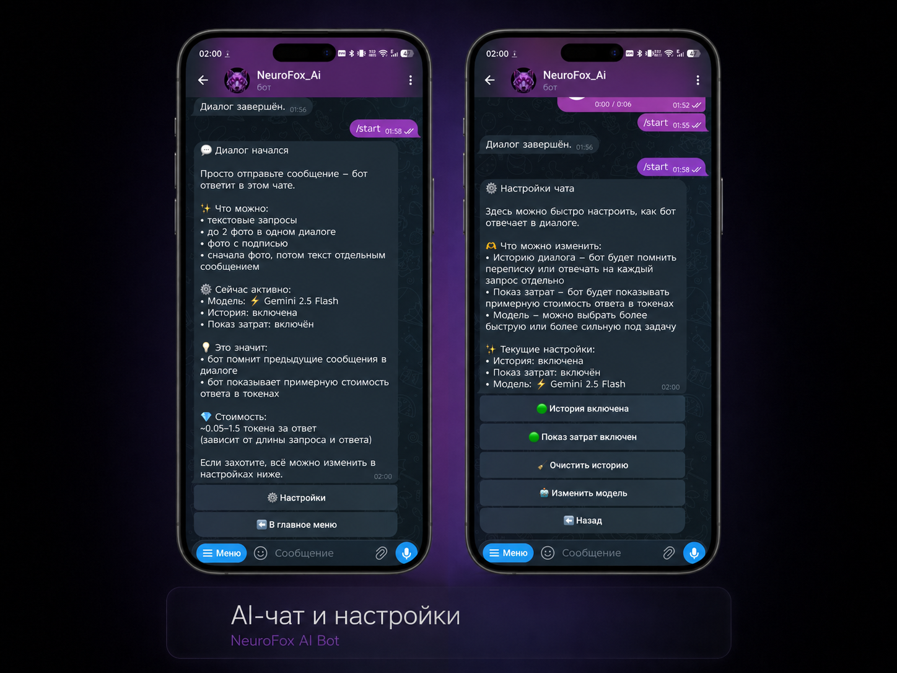
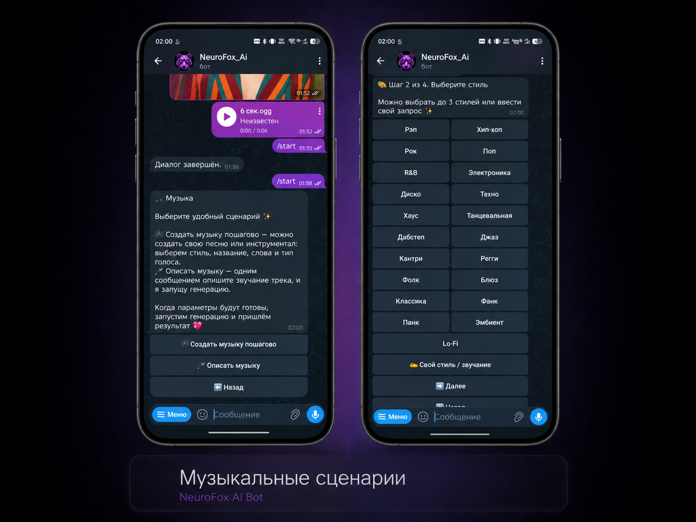

# NeuroFox AI в Telegram

**Нейросети прямо в чате.** Фото, видео, музыка и AI-чат без сайтов и регистрации. Оплата картой, через СБП или звёздами Telegram.

> **Работает у заказчика больше года, пользователей уже 150+**

## Как это работает

1. **Открыть бота.** Одно нажатие в Telegram, без паролей и анкет.
2. **Выбрать, что сделать.** Фото, видео, музыка или вопрос AI-чату.
3. **Получить результат в чат.** Готовый файл приходит сообщением, его сразу можно сохранить или переслать.

## [Открыть бота в Telegram »](https://t.me/Malinovsky_AI_bot)

<table>
<tr>
<td width="50%" align="center"> <b>Главное меню</b></td>
<td width="50%" align="center"> <b>Тарифы и оплата</b></td>
</tr>
</table>

<b>Ещё 5 экранов</b>

**Деньги в боте считаются сами:** токены по подписке и вечные токены, промокоды, история платежей и реферальная программа, где за приглашённых друзей платят реальными деньгами.

Для разработчиков

Здесь несколько частей, по которым видно подход. Ключей, платёжных настроек и данных пользователей в репозитории нет.

- `architecture-shell/`: срез устройства бота с тестами: списание токенов, генерация, защита от двойного начисления.
- `src-examples/`: примеры кода: задача генерации, статус платежа, списание токенов, кнопки меню.
- `docs/`: как устроены генерация, токены и оплата, что убрано из публичной версии.

Python, Aiogram 3, PostgreSQL, Redis, фоновые задачи. Полный код закрыт и показывается по запросу.

Есть и веб-версия сервиса: [neurofox-ai](https://github.com/qXstay/neurofox-ai).

Нужен бот с оплатой прямо в Telegram? Напишите в [Telegram](https://t.me/qxstay).
