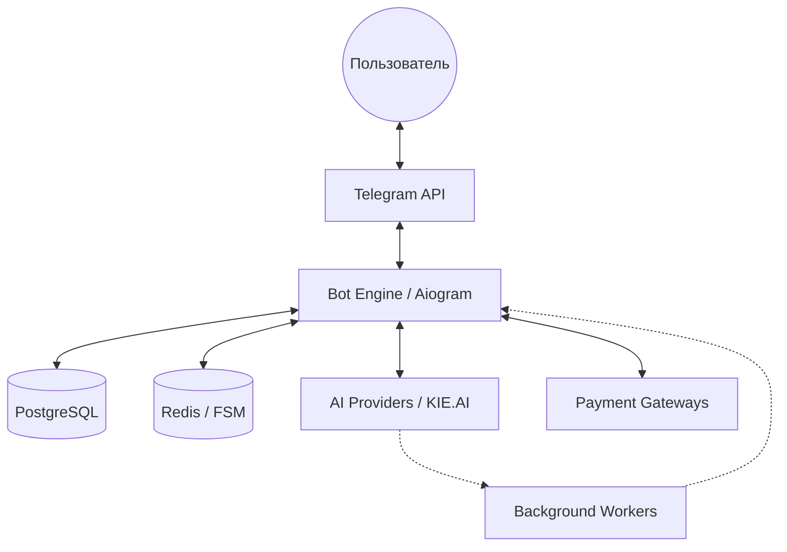

# Архитектура и технические решения

## Обзор системы

Проект спроектирован как отказоустойчивое асинхронное приложение, способное обрабатывать сотни одновременных запросов к AI-моделям. Основной приоритет архитектуры — **бесшовный пользовательский опыт** при выполнении ресурсоемких задач.

## Ключевые компоненты

1.  **Интерфейсный слой (Aiogram 3):**
    - Использование современной версии фреймворка с поддержкой типизации и улучшенных Middleware.
    - Управление сложными сценариями через асинхронную машину состояний (FSM).
2.  **Слой бизнес-логики (Service Layer):**
    - Полная изоляция AI-интеграций и платежных шлюзов от логики бота.
    - Единый интерфейс для взаимодействия с различными AI-провайдерами.
3.  **Слой данных (PostgreSQL & Redis):**
    - **PostgreSQL:** Транзакционное хранение балансов, истории покупок и метаданных генераций.
    - **Redis:** Хранение состояний пользователей и кэширование временных данных для быстрого отклика.
4.  **Асинхронные воркеры (Background Tasks):**
    - Отдельные процессы для мониторинга статусов генерации (например, видео).
    - Система автоматических уведомлений пользователя о готовности результата.

## UX-решение: Persistent UI Panel

Вместо традиционной для ботов "ленты сообщений", NeuroFox использует концепцию **единой панели управления**:

- **Динамическое обновление:** Меню, кнопки и статусы (Progress Bar) обновляются в одном сообщении.
- **Чистота чата:** Пользователь не теряется в истории сообщений; результат генерации привязан к кнопкам управления.
- **Статус в реальном времени:** Визуальное отображение этапов (очередь -> генерация -> загрузка).

## Схема потоков данных

## Надежность и масштабирование

- **Webhook-driven:** Использование вебхуков для получения уведомлений от Telegram и платежных систем (YooKassa/Prodamus).
- **Graceful Error Handling:** Система автоматических возвратов (refund) токенов при сбоях на стороне AI-провайдеров.
- **S3 Storage:** Использование облачных хранилищ для эффективной раздачи тяжелого контента (видео/фото).
